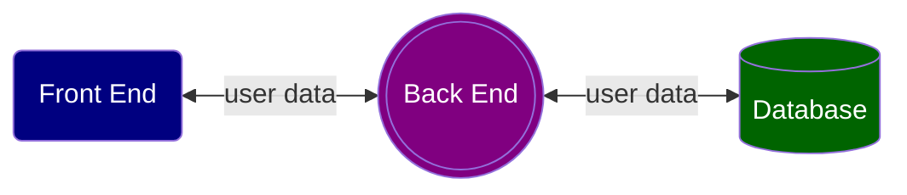
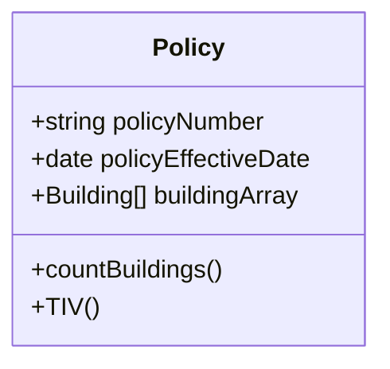

# Markdown with mermaid, prismjs and katex
        
**Table of Contents**
- [Markdown with mermaid, prismjs and katex](#markdown-with-mermaid-prismjs-and-katex)
  - [1. Basic Syntax](#1-basic-syntax)
  - [8. Horizontal rule: --- (triple -)](#8-horizontal-rule-----triple--)
  - [2. Extended Syntax](#2-extended-syntax)
  - [3. mermaid](#3-mermaid)
  - [4. prismjs](#4-prismjs)
  - [5. katex](#5-katex)

## 1. Basic Syntax
1. Headings: #, ##, ###
2. Text formatting
    - Bold: **bold** (double *)
    - Italic: *italic* (single *)
    - Bold & italic: ***bold and italic*** (triple *)
3. Block quote: >
> The Difference Between Stupidity and Genius Is That Genius Has Its Limits. <br> &mdash; ***Albert Einstein***
4. Lists
    - Ordered list: 1. 2. 3. 
    - Unordered list: -
5. Code: \` (backtick) <br>
    `const app = require('express')`
6. Link:
    - Internal link to a heading: \[`link text`\]\(\#`transformed heading`\) <br>
    💩💩💩 heading transformation rules: <br>
        - one or more whitespaces are replaced with a single hyphen -
        - uppercase letters are converted to lowercase
        - special characters are removed
    - External link/email link: \[`link text`\]\(`external URL`\)
        - My favorite search engine is [Google](https://google.com).
        - Contact me [Rui Wang](mailto:%20rui.wang.624@gmail.com)<br>
        Use %20 after `mailto:`, as blanks are not allowed in URL.
    - URL and email: \< \> <br>
    <https://google.com> <br>
    <rui.wang.624@gmail.com>

7. Embeded image: html <br>
    
8. Horizontal rule: --- (triple -)
---

## 2. Extended Syntax
1. Table: 
    - --- (3+ hyphens) for header; 
    - | (pipe) to separate column;
    - : (colon) to align;

    | name | school |
    | :---  | ---:    |
    | Claire | Luce |
    | Panelope | Kennedy |
2. Fenced code block (with syntax highlighting): \`\`\` [language]
    ```typescript
    let x = 5;
    console.log(x ** 2);
    ```
3. Strikethrough: ~~strikethrough~~ (double ~)
4. Highlighting: \(<mark\></mark\>\) <br>
   These text are <mark>highlighted</mark>:
5. Task list: - \[x\] your text
    - [x] feed cat
    - [x] watch movie
    - [ ] go to bed
6. Subscript: \(<sub\></sub\>\) <br>
   H<sub>2</sub>O
7. Superscript:\(<sup\></sup\>\) <br>
   X<sup>2</sup>

## 3. mermaid
For charts
Remember to install 'Markdown Preview Mermaid Support' VSC extension so you can view mermaid charts during development.

- Flowchart

- Class


## 4. prismjs
Source code syntax highlighting
```typescript
    const x = 30;
    console.log(x);
```

## 5. katex
Complex math fomulas

$S_{final} = {\frac {\sum_{i=1}^3 S_i} 3} \times \pi$, where $S_i$  &isin; {math, English, coding}

