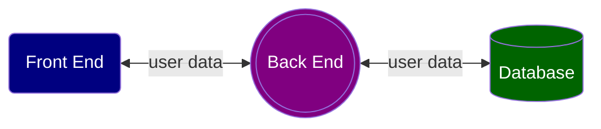

## Markdown
### 1. source code highlighting
```typescript
    const x = 5;
    console.log(x);
```

### 2. mermaid chart


### 3. embedded image


### 4. math formula
$S_{final} = {\frac {\sum_{i=1}^3 S_i} 3} \times \pi$, where $S_i$  &isin; {math, English, coding}


